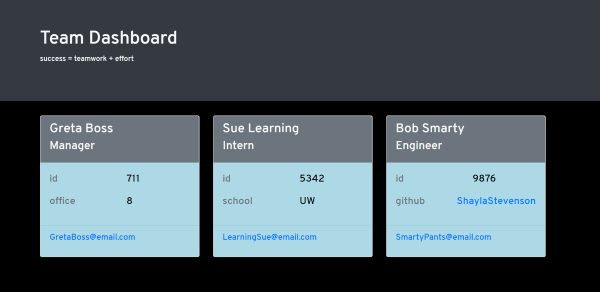
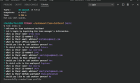

# Team Dashboard Builder   
Generate a reactive dashboard to display information about the members of your team. From the command line, you will input data that will be displayed in a polished and professional document. The Team Dashboard Builder will help keep personnel information organized and usable. 

## Table of Contents

  * [Installation](#Installation)

  * [Usage](#Usage)

  * [Tests](#Tests)

  * [Questions](#Questions)

  * [License](#License)

## Installation
To install the application:
* Clone the application's repo

      git@github.com:ShaylaStevenson/team-dashboard.git

* Install necessary dependencies 

      npm i

## Usage
Once necessary dependencies have been installed:
* Run the application:
  
      node index.js

    You will then be greeted with a series of prompts. Upon completion of the prompts, you will be alerted that your HTML file has been generated. You will find it displayed in the main directory of the application, titled *index.HTML*. Open said file in your browser to see the magic!

## Demo
To view an example HTML output:
* [Generated HTML](dist/example-index.HTML)

To view a video walkthrough, play:

## Tests
All tests are passing when run.

* To run tests using Jest:

      npm run test

* Test output:

      PASS  _tests_/employee.test.js
      PASS  _tests_/engineer.test.js
      PASS  _tests_/intern.test.js
      PASS  _tests_/manager.test.js

        Test Suites: 4 passed, 4 total
        Tests:       24 passed, 24 total
        Snapshots:   0 total
        Time:        3.359 s
        Ran all test suites.

  

## Questions
Don't hesitate to reach out 
  * Github Username: ShaylaStevenson
  * [View Github Profile](https://github.com/ShaylaStevenson)
  * [View Project Repository](https://github.com/ShaylaStevenson/team-dashboard)
  * Email: shayla.rose.stevenson@gmail.com
  

## License
This project is licensed under the terms of the MIT license. View license at:
https://opensource.org/licenses/MIT.

